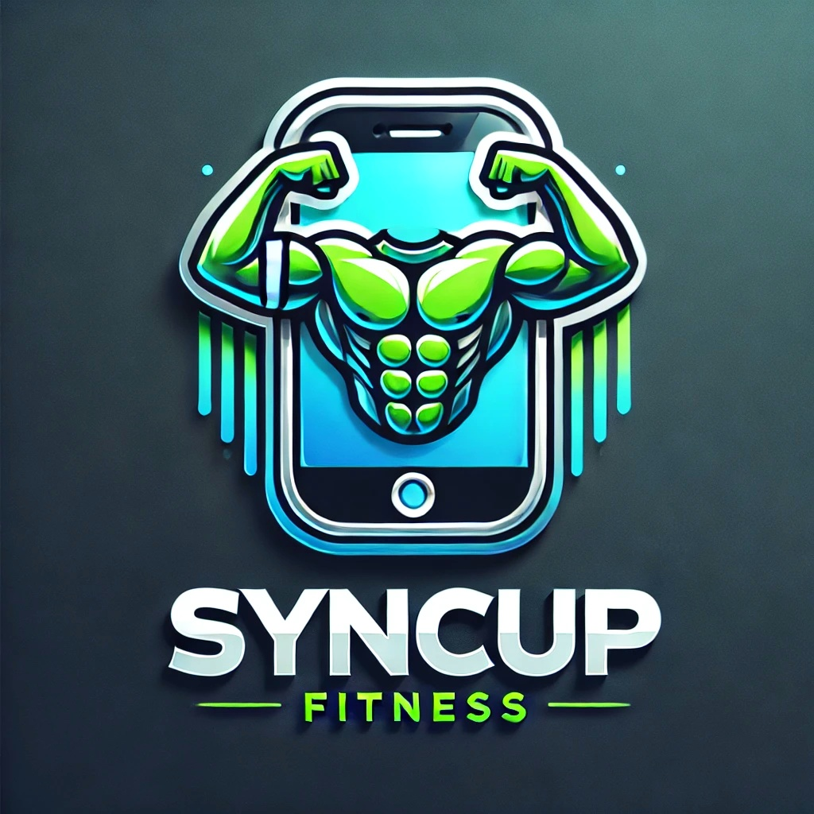

---

 

[Presentation](#presentation) | [Objective](#objective) | [Hardware](#hardware)

---

## Presentation  

**Project Name**: SyncUp Fitness  

(Reflects the idea of synchronizing to achieve fitness goals)  

### Problem Statement  

Not everyone can afford a personal coach in a gym or a CrossFit facility. This project was born from that realization. We aim to prevent gym members from injuring themselves due to improper movements and provide them with detailed insights on how their bodies respond to exercises, as well as ways to improve.  

### Objective  

This project aims to collect various body metrics such as heart rate, blood oxygen levels, temperature, etc.  

All this data will then be accessible to the user via an application, allowing them to analyze their movements from their last set, posture, heart rate, calorie expenditure, and more.  

Later, an AI using a **modifiable VFTD model** will process these data and suggest areas for improvement to the user.  

## GitLab Structure  

The root of the GitHub repository consists of three main folders:  

[**Syncup_fitness_app**](Application) : **Application code**  

[**Documentation**](Documentation) : **Contains all project documentation**  

[**Hardware code**](Hardware) : **Hardware-related code**  

⚠️ Application code is still in progress!  

## Hardware  

### Motherboard Solution:  
   - **Raspberry Pi 4**: This is the best solution for this project, offering compatibility with a wide range of sensors, good software support, built-in Bluetooth, and Wi-Fi.  

### Camera  
   - **IMX477 Camera**: Supports wide-angle functionality, useful during workout sessions.  

## Application  

The application will be developed using **Flutter (Dart)** to ensure accessibility on all mobile platforms (Android and iOS) and enable seamless Bluetooth integration.  

## Database  

We will use **Firebase** to manage user accounts, permissions, and data storage.  

## Main Branch  

**Master**  

## Developers  

  

  

<strong>VERDIER Nathan</strong>  

---

&nbsp; 
&nbsp;  
&nbsp; 
&nbsp; 

---

